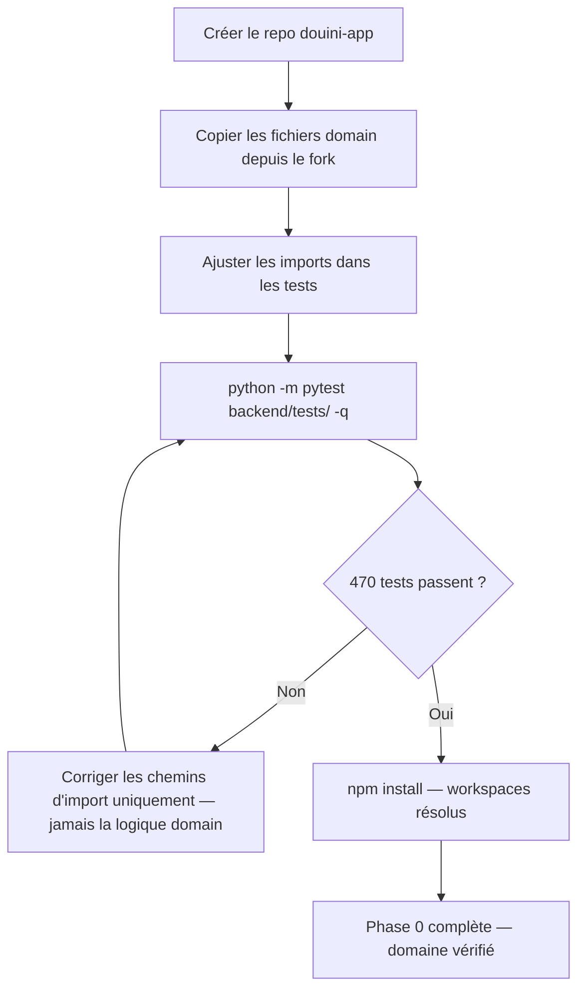
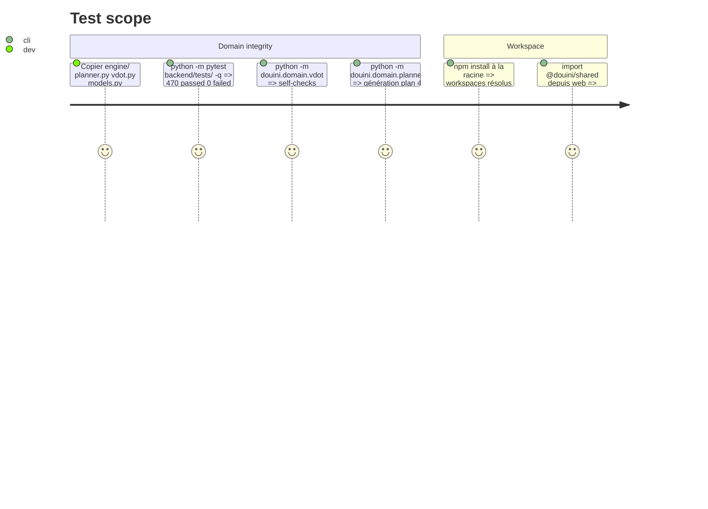

# Instruction: Bootstrap Monorepo + Domain Copy

## Architecture projection

> Tree of the final files. ✅ create · ✏️ modify · ❌ delete

```txt
douini-app/
  .gitignore                          ✅ create
  .env.example                        ✅ create  — header only, vars ajoutés par phase
  package.json                        ✅ create  — npm workspaces root
  README.md                           ✅ create
  backend/
    pyproject.toml                    ✅ create
    douini/
      __init__.py                     ✅ create
      domain/                         ✅ create  — copié verbatim depuis le fork
        engine/                       ✅ copy    — 2 973 LOC, 13 fichiers + data/ + workouts/
        planner.py                    ✅ copy
        vdot.py                       ✅ copy
        models.py                     ✅ copy
        exporters.py                  ✅ copy
        domain/README.md              ✅ create  — "Read-only. Never modify here."
    tests/                            ✅ create  — 470 tests portés depuis le fork
      __init__.py                     ✅ create
  packages/
    shared/
      package.json                    ✅ create  — stub, complété en phase 5
      tsconfig.json                   ✅ create
      src/
        index.ts                      ✅ create  — export {} vide
  web/
    package.json                      ✅ create  — stub, complété en phase 6
  mobile/
    package.json                      ✅ create  — stub, complété en phase 8
    app.json                          ✅ create  — Expo config minimal
```

## User Journey



## Test Scope



## Tasks to do

### `1)` Créer le squelette monorepo

> Mettre en place la structure de répertoires et les fichiers de configuration racine du monorepo.

1. Créer le répertoire douini-app/ (le nouveau repo).
2. Créer le package.json racine avec "workspaces": ["packages/*", "web", "mobile"] et scripts : dev:web, dev:mobile, build:shared, typecheck, lint.
3. Créer .gitignore couvrant : Python (__pycache__/, .venv/, *.pyc, .pytest_cache/, *.egg-info/, dist/), Node (node_modules/, dist/, .expo/, *.tsbuildinfo), env (.env, *.env.local), DB (*.db, *.sqlite), secrets (~/.douini/), OS (.DS_Store).
4. Créer .env.example avec uniquement un header commentaire — les vars sont ajoutées par phase. Note : ce fichier n'est jamais chargé automatiquement ; exporter les vars manuellement en dev.
5. Créer README.md : nom du projet, résumé du stack, comment démarrer (backend dev, web dev, mobile dev), lien vers docs/.

### `2)` Bootstrap du package Python backend

> Initialiser le package Python backend avec pyproject.toml et les modules de base.

1. Créer backend/pyproject.toml avec [project] : name douini-backend, version 2.0.0, requires Python >=3.11. Section dependencies vide — complétée par phase. Inclure [build-system] avec setuptools. Inclure [tool.pytest.ini_options] avec testpaths = ["tests"] et pythonpath = ["."].
2. Créer backend/douini/__init__.py (vide).
3. Créer backend/douini/domain/__init__.py (vide).

### `3)` Copier le domaine depuis le fork

> Transférer verbatim le code domaine du fork vers le backend sans aucune modification.

1. Copier les éléments suivants depuis src/douini_run/ du fork vers backend/douini/domain/ verbatim — aucune modification : engine/ (répertoire entier, tous les fichiers + data/ + workouts/), planner.py, vdot.py, models.py, exporters.py.
2. Ne pas copier : webapp.py, db.py, services.py, cli.py, garmin.py, garmin_import.py, template_ui.py, reference_views.py, completion_ui.py, design.py, whats_new_ui.py, release_notes.py, mailer.py, api.py.
3. Créer backend/douini/domain/README.md : "Read-only. Copié depuis le repo douini-run. Ne jamais modifier ici — patcher dans le repo source."

### `4)` Porter la suite de tests

> Récupérer les 470 tests du fork et les faire passer avec les nouveaux chemins d'import.

1. Copier les 10 fichiers de tests depuis tests/ du fork vers backend/tests/.
2. Dans chaque fichier de test, remplacer from douini_run. par from douini.domain. pour les imports domain. Aucun autre changement.
3. Créer backend/tests/__init__.py (vide).
4. Vérifier : cd backend && python -m pytest tests/ -q → 470 tests, 0 failures. Si un test échoue sur un import, corriger uniquement le chemin d'import — jamais la logique domain.

### `5)` Créer les packages frontend stubs

> Créer les packages frontend stubs (shared, web, mobile) pour valider la résolution des workspaces.

1. packages/shared/package.json : { "name": "@douini/shared", "version": "0.0.1", "main": "src/index.ts", "scripts": { "build": "tsc", "typecheck": "tsc --noEmit" } }.
2. packages/shared/tsconfig.json : strict true, moduleResolution bundler.
3. packages/shared/src/index.ts : export {};.
4. web/package.json : { "name": "@douini/web", "private": true, "scripts": { "dev": "echo 'not yet'", "build": "echo 'not yet'" }, "dependencies": { "@douini/shared": "*" } }.
5. mobile/package.json : { "name": "@douini/mobile", "private": true, "scripts": { "start": "echo 'not yet'" }, "dependencies": { "@douini/shared": "*" } }.
6. mobile/app.json : config Expo minimale avec name: "Douini Run", slug: "douini-run", version: "1.0.0".
7. Lancer npm install à la racine — vérifier que les workspaces se résolvent sans erreur.

## Test acceptance criteria

| Task | Acceptance criteria              |
| ---- | -------------------------------- |
| 1    | Structure du repo correspond à la projection ; .gitignore couvre tous les patterns listés |
| 2    | cd backend && python -c "import douini" réussit |
| 3    | Tous les fichiers domain présents dans backend/douini/domain/ ; aucun fichier NiceGUI/UI copié |
| 4    | cd backend && python -m pytest tests/ -q → 470 passed, 0 failed |
| 5    | npm install à la racine réussit ; @douini/shared se résout depuis web/ et mobile/ |
