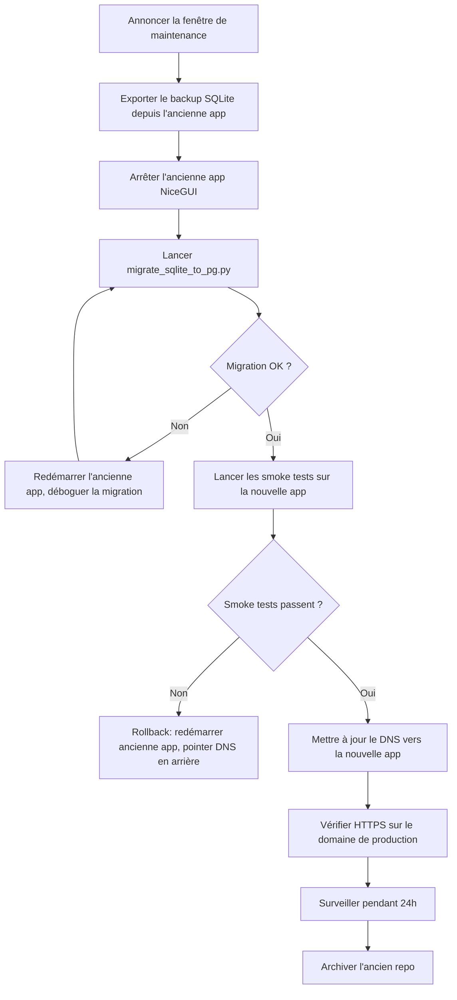
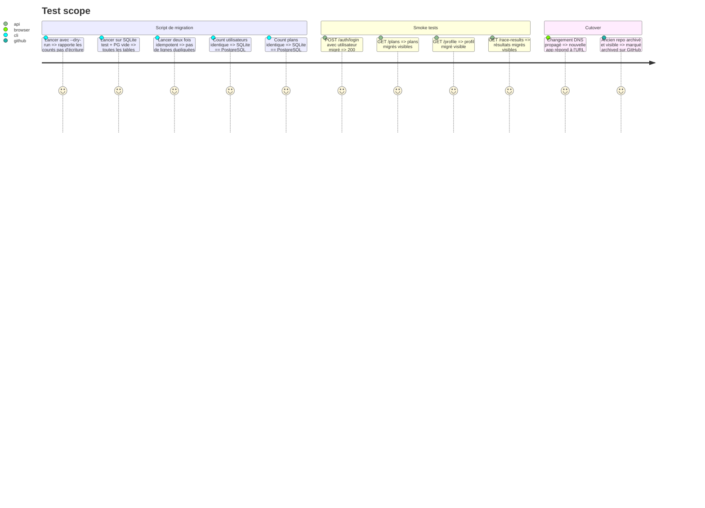

# Instruction: Production Cutover + Data Migration

## Architecture projection

> Tree of the final files. ✅ create · ✏️ modify · ❌ delete

```txt
scripts/
  migrate_sqlite_to_pg.py             ✅ create  — migration one-shot SQLite → PostgreSQL
docs/
  cutover.md                          ✅ create  — procédure pas-à-pas, plan de rollback
```

## User Journey



## Test Scope



## Tasks to do

### `1)` Créer scripts/migrate_sqlite_to_pg.py

> Écrire le script de migration one-shot de SQLite vers PostgreSQL avec dry-run, idempotence et remapping d'IDs.

1. Accepter --sqlite-path (chemin vers douini.db) et --postgres-url comme arguments CLI.
2. Accepter le flag --dry-run — lire le SQLite, afficher les counts par table, n'écrire rien en PostgreSQL.
3. Ordre de migration (respecter les contraintes FK) :
   - users (construire un dict de mapping old_id → new_id)
   - profile (remapper user_id)
   - plans (remapper user_id ; sessions_json déjà chaîne JSON → insérer en JSONB)
   - plan_sessions (remapper user_id, plan_id)
   - session_feedback (remapper session_id)
   - plan_adjustments (remapper plan_id)
   - race_results (remapper user_id, plan_id)
   - profile_vdot_history (remapper user_id)
4. Utiliser INSERT ... ON CONFLICT DO NOTHING pour rendre le script re-exécutable.
5. Après chaque table : logger le count migré vs count dans SQLite. Asserter l'égalité avant de continuer.
6. À la fin : afficher le résumé + "Migration complète. Vérifier avec les smoke tests."

### `2)` Checklist des smoke tests (documentée, pas automatisée)

> Définir la checklist manuelle des smoke tests à exécuter après la migration sur la nouvelle app.

1. Login avec un compte utilisateur migré.
2. Vérifier que la liste des plans affiche les plans corrects.
3. Vérifier que le profil affiche le VDOT et le volume corrects.
4. Vérifier que les résultats de courses sont visibles.
5. Marquer une séance done → vérifier que le statut persiste.
6. Connecter Garmin si applicable → vérifier le statut.

### `3)` Créer docs/cutover.md

> Documenter la procédure de cutover pas-à-pas avec plan de rollback.

1. Pré-cutover : backup SQLite, backup PostgreSQL (si des données existent), annoncer la maintenance.
2. Étape par étape : lancer le script de migration avec --dry-run d'abord, vérifier les counts, lancer sans --dry-run, vérifier à nouveau, lancer les smoke tests.
3. Mise à jour DNS : changer l'enregistrement A de l'IP de l'ancien serveur vers le VPS. Note sur le TTL.
4. Rollback : si problème avant DNS — redémarrer l'ancienne app. Si après DNS — remettre le DNS + redémarrer l'ancienne app.
5. Post-cutover : surveiller les logs pendant 24h, archiver l'ancien repo sur GitHub (ne pas supprimer), mettre à jour le README.

### `4)` Archiver l'ancien repo

> Archiver l'ancien repo GitHub en gardant l'accès et en pointant vers le nouveau repo.

1. Sur GitHub : Settings → Archive repository.
2. Ajouter dans le README de l'ancien repo : "Ce repository est archivé. Le projet continue sur [URL du nouveau repo]."
3. Garder l'ancien repo accessible — ne pas supprimer. La référence du code reste précieuse.

## Test acceptance criteria

| Task | Acceptance criteria              |
| ---- | -------------------------------- |
| 1    | --dry-run produit uniquement des counts ; la vraie exécution migre toutes les lignes ; la deuxième exécution produit 0 duplicates |
| 1    | Counts utilisateurs, plans, séances, résultats de courses identiques entre source SQLite et destination PG |
| 2    | La checklist des smoke tests passe sur l'URL de production après le cutover |
| 3    | cutover.md couvre pré/pendant/post et rollback avec les commandes exactes |
| 4    | L'ancien repo est archivé et visible ; le README pointe vers le nouveau repo |
