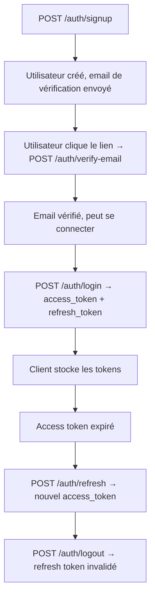

# Instruction: Auth API (JWT + Email Verify + Rate Limiting + Reset)

## Architecture projection

> Tree of the final files. ✅ create · ✏️ modify · ❌ delete

```txt
backend/
  pyproject.toml                      ✏️ modify  — ajouter python-jose, passlib
  requirements.lock                   ✏️ modify  — régénérer après ajout deps
  alembic/versions/
    002_users.py                      ✅ create  — users, email_verifications, password_resets, refresh_tokens
  douini/
    auth/
      __init__.py                     ✅ create
      jwt.py                          ✅ create  — access + refresh token création/vérification
      password.py                     ✅ create  — bcrypt via passlib
      rate_limit.py                   ✅ create  — sliding window in-memory par IP
      email.py                        ✅ create  — tokens de vérification email
      reset.py                        ✅ create  — tokens reset mot de passe usage unique, TTL 1h
    db/queries/
      auth.py                         ✅ create  — CRUD users + tokens
    api/
      routes/
        auth.py                       ✅ create  — 9 endpoints (signup, verify, resend, login, refresh, logout, forgot, reset, me)
      dependencies.py                 ✏️ modify  — ajouter get_current_user, get_verified_user
    mailer.py                         ✅ create  — repris de l'app actuelle, adapté settings SMTP
    settings.py                       ✏️ modify  — ajouter SMTP_*, ACCESS_TOKEN_*, REFRESH_TOKEN_*
  tests/
    api/
      __init__.py                     ✅ create
      test_auth.py                    ✅ create  — tests des 9 endpoints
.env.example                          ✏️ modify  — ajouter vars SMTP et TTL tokens
```

## User Journey



## Test Scope


## Tasks to do

### `1)` Créer auth/password.py

> Hashing bcrypt via passlib.

1. Utiliser `passlib.context.CryptContext(schemes=["bcrypt"], deprecated="auto")`.
2. Exposer `hash_password(plain: str) -> str` et `verify_password(plain: str, hashed: str) -> bool`.
3. Validation à l'inscription : minimum 8 caractères, rejeter si dans une liste courte de mots de passe communs (["password", "12345678", "douini", "password1"]).

### `2)` Créer auth/jwt.py

> JWT encode/decode avec python-jose.

1. Utiliser `python-jose` avec algorithme HS256 et `settings.SECRET_KEY`.
2. `create_access_token(user_id: int, email: str) -> str` — expire dans `settings.ACCESS_TOKEN_EXPIRE_MINUTES`.
3. `create_refresh_token(user_id: int) -> tuple[str, str]` — retourne `(token, jti)`. Expire dans `settings.REFRESH_TOKEN_EXPIRE_DAYS`. Le refresh token porte un jti (UUID4) pour le suivi de rotation.
4. `decode_token(token: str) -> dict` — lève `JWTError` sur token invalide/expiré.

### `3)` Créer auth/rate_limit.py

> Sliding window in-memory par IP.

1. Sliding window in-memory : `dict[str, deque[float]]` clé = adresse IP.
2. `check_rate_limit(ip: str, max_attempts: int = 5, window_seconds: int = 900)` — lève `HTTPException(429)` si dépassé.
3. Appelé en tête des endpoints login, signup, forgot-password, reset-password.
4. Documenter : solution in-process suffisante pour 1 worker ; Redis nécessaire pour multi-worker.

### `4)` Créer auth/email.py

> Tokens de vérification email avec hash SHA-256.

1. Générer les tokens de vérification email : `secrets.token_urlsafe(32)`.
2. Stocker le hash SHA-256 du token dans `email_verifications` : `user_id, token_hash, expires_at` (+24h), `used_at`.
3. `verify_email_token(token_hash: str, db) -> int` — retourne `user_id` si valide, non utilisé, non expiré ; lève `HTTPException(400)` sinon.

### `5)` Créer auth/reset.py

> Tokens reset mot de passe usage unique, TTL 1h.

1. Même pattern que la vérification email mais expire dans 1 heure.
2. Hash du token stocké dans `password_resets`.
3. À la réinitialisation réussie : marquer le token utilisé, mettre à jour le hash du mot de passe, invalider tous les refresh tokens de l'utilisateur (`DELETE FROM refresh_tokens WHERE user_id = ?`).
4. Ne jamais révéler si l'email existe dans la réponse forgot-password.

### `6)` Créer db/queries/auth.py

> CRUD users + tokens, toutes les fonctions prennent conn en premier paramètre.

1. `create_user(conn, email, password_hash) -> int` — retourne l'ID utilisateur.
2. `get_user_by_email(conn, email) -> dict | None`.
3. `get_user_by_id(conn, user_id) -> dict | None`.
4. `mark_email_verified(conn, user_id) -> None`.
5. `store_refresh_token(conn, user_id, jti, expires_at) -> None`.
6. `invalidate_refresh_token(conn, jti) -> None`.
7. `invalidate_all_refresh_tokens(conn, user_id) -> None`.
8. `get_refresh_token(conn, jti) -> dict | None` — retourne le token si non invalidé et non expiré.
9. `store_email_verification_token(conn, user_id, token_hash, expires_at) -> None`.
10. `consume_email_verification_token(conn, token_hash) -> int | None` — retourne `user_id` ou `None`.
11. `store_reset_token(conn, user_id, token_hash, expires_at) -> None`.
12. `consume_reset_token(conn, token_hash) -> int | None`.
13. `update_password(conn, user_id, new_hash) -> None`.

### `7)` Créer api/routes/auth.py

> 9 endpoints auth sur APIRouter(prefix="/auth", tags=["auth"]).

1. `POST /signup` — valider input, vérifier doublon, hacher mot de passe, créer utilisateur, envoyer email de vérification, retourner 201 `{"message": "Verification email sent"}`.
2. `POST /verify-email` — body `{token: str}`, vérifier le token, marquer email vérifié, retourner 200.
3. `POST /resend-verification` — si utilisateur existe et non vérifié, renvoyer. Réponse identique qu'il existe ou non (pas d'énumération).
4. `POST /login` — rate-limit par IP, vérifier credentials, vérifier email vérifié, retourner `AuthTokens`.
5. `POST /refresh` — body `{refresh_token: str}`, valider jti, rotation (émettre nouveau, invalider ancien), retourner nouvel access token.
6. `POST /logout` — body `{refresh_token: str}`, invalider le jti.
7. `POST /forgot-password` — rate-limit, créer token reset, envoyer email, toujours retourner 200.
8. `POST /reset-password` — body `{token: str, new_password: str}`, consommer token, mettre à jour mot de passe, invalider toutes les sessions.
9. `GET /me` — `Depends(get_current_user)`, retourne le dict user. Utilisé par le hook `useAuth` côté frontend.

### `8)` Créer mailer.py

> SMTP adapté depuis l'app actuelle, dev-friendly.

1. Reprendre la logique de `mailer.py` de l'app actuelle.
2. Adapter pour lire `settings.SMTP_HOST`, `SMTP_PORT`, `SMTP_USER`, `SMTP_PASSWORD`, `SMTP_FROM`.
3. En dev sans SMTP configuré : logger l'URL de vérification au lieu d'envoyer (`DEBUG: verification link: {url}`).
4. Fonctions : `send_verification_email(to, token)`, `send_reset_email(to, token)`.

### `9)` Mettre à jour api/dependencies.py

> Ajouter get_current_user et get_verified_user.

1. Ajouter `OAuth2PasswordBearer(tokenUrl="/api/v1/auth/login")`.
2. `async def get_current_user(token: str = Depends(oauth2_scheme), db = Depends(get_db)) -> dict` — décoder JWT, récupérer utilisateur depuis DB, lever 401 si invalide.
3. `async def get_verified_user(user = Depends(get_current_user)) -> dict` — lever 403 si email non vérifié.

### `10)` Migration Alembic 002_users.py

> 4 tables : users, email_verifications, password_resets, refresh_tokens.

1. `users` : `id SERIAL PRIMARY KEY, email TEXT UNIQUE NOT NULL, password_hash TEXT NOT NULL, email_verified BOOLEAN DEFAULT FALSE, created_at TIMESTAMPTZ DEFAULT NOW(), updated_at TIMESTAMPTZ DEFAULT NOW()`.
2. `email_verifications` : `id SERIAL PRIMARY KEY, user_id INT REFERENCES users(id) ON DELETE CASCADE, token_hash TEXT NOT NULL, expires_at TIMESTAMPTZ NOT NULL, used_at TIMESTAMPTZ`.
3. `password_resets` : même structure que `email_verifications`.
4. `refresh_tokens` : `id SERIAL PRIMARY KEY, user_id INT REFERENCES users(id) ON DELETE CASCADE, jti TEXT UNIQUE NOT NULL, expires_at TIMESTAMPTZ NOT NULL, invalidated_at TIMESTAMPTZ`.

### `11)` Mettre à jour settings.py et .env.example

> Ajouter vars SMTP, TTL tokens, frontend URL.

1. Ajouter dans settings : `ACCESS_TOKEN_EXPIRE_MINUTES: int = 30`, `REFRESH_TOKEN_EXPIRE_DAYS: int = 30`, `SMTP_HOST: str = ""`, `SMTP_PORT: int = 587`, `SMTP_USER: str = ""`, `SMTP_PASSWORD: str = ""`, `SMTP_FROM: str = ""`, `FRONTEND_URL: str = "http://localhost:5173"`.
2. SMTP optionnel en dev (si `SMTP_HOST` vide, logger le lien au lieu d'envoyer).
3. Ajouter toutes les nouvelles vars dans `.env.example` avec valeurs dev et guidance prod.

### `12)` Mettre à jour pyproject.toml avec les dépendances auth

> Ajouter les deps nécessaires pour JWT et hashing.

1. Ajouter dans [project].dependencies : `python-jose[cryptography]>=3.3`, `passlib[bcrypt]>=1.7`.
2. Régénérer `backend/requirements.lock` après installation.

### `13)` Créer backend/tests/api/test_auth.py

> Tests des 9 endpoints auth avec httpx.AsyncClient + pytest-asyncio.

1. Créer `backend/tests/api/__init__.py`.
2. Créer `backend/tests/api/test_auth.py` couvrant les cas listés dans le Test Scope : signup valide/dupliqué/mauvais mot de passe, verify-email valide/expiré/réutilisé, login valide/non vérifié/mauvais mot de passe, GET /auth/me avec/sans token, refresh valide/expiré/réutilisé, forgot/reset password.
3. Utiliser une fixture de DB de test (transaction rollback) et un client `httpx.AsyncClient`.

## Test acceptance criteria

| Task | Acceptance criteria |
| ---- | ------------------- |
| 1 | Round-trip hash_password / verify_password ; mots de passe faibles rejetés avec 422 |
| 2 | JWT valide décodé ; JWT expiré lève JWTError ; rotation refresh invalide l'ancien jti |
| 3 | 6e tentative dans la fenêtre retourne 429 ; fenêtre reset après expiry |
| 4-5 | Tokens de vérification et reset : valide → succès ; expiré → 400 ; réutilisation → 400 |
| 6 | Toutes les 13 fonctions queries s'exécutent contre la DB de test sans erreur |
| 7 | Les 9 endpoints retournent les codes de statut documentés ; pas d'énumération sur forgot-password ; GET /auth/me retourne le user courant |
| 8 | En dev sans SMTP : lien loggué, pas d'erreur ; avec SMTP : email envoyé |
| 9 | Depends(get_current_user) retourne le dict user ; token manquant/invalide retourne 401 |
| 10 | alembic upgrade head crée les 4 tables ; downgrade -1 les supprime proprement |
| 11 | Toutes les nouvelles vars présentes dans .env.example avec guidance |
| 12 | python-jose et passlib installés ; requirements.lock régénéré |
| 13 | Tous les cas du Test Scope passent ; pas d'énumération sur forgot-password |
