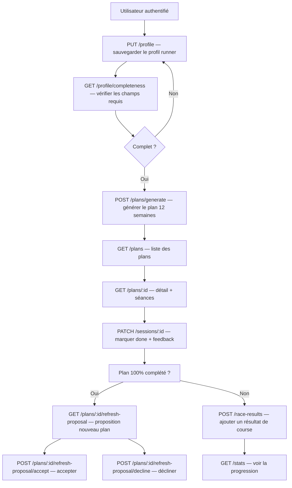
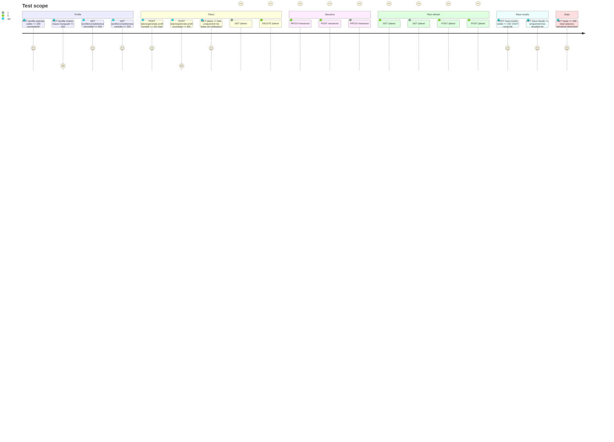

# Instruction: Core API Endpoints (Profile, Plans, Sessions, Race, Stats, Refresh)

## Architecture projection

> Tree of the final files. ✅ create · ✏️ modify · ❌ delete

```txt
backend/
  pyproject.toml                      ✏️ modify  — aucune nouvelle dep (domain déjà présent)
  alembic/versions/
    003_profile.py                    ✅ create  — table profile
    004_plans.py                      ✅ create  — plans, plan_sessions, session_feedback, plan_adjustments, plan_refresh_state, plan_celebrations
    005_race_results.py               ✅ create  — race_results, profile_vdot_history
  douini/
    api/
      schemas.py                      ✅ create  — Pydantic v2 schemas wrappant les dataclasses domain
      routes/
        profile.py                    ✅ create  — GET/PUT profile, GET completeness
        plans.py                      ✅ create  — POST generate, GET list/detail, DELETE, refresh-proposal
        sessions.py                   ✅ create  — GET/PATCH session, POST feedback, POST adjust
        race_results.py               ✅ create  — POST/GET/DELETE race results
        statistics.py                 ✅ create  — GET stats utilisateur
      main.py                         ✏️ modify  — enregistrer les nouveaux routers
    db/queries/
      profile.py                      ✅ create
      plans.py                        ✅ create
      sessions.py                     ✅ create
      race_results.py                 ✅ create
    services/
      __init__.py                     ✅ create
      plan.py                         ✅ create  — generate, serialize, deserialize
      feedback.py                     ✅ create  — traitement feedback post-séance
      race.py                         ✅ create  — mise à jour VDOT depuis résultat course
      refresh.py                      ✅ create  — build_refresh_proposal, accept, decline
  tests/
    api/
      test_plans.py                   ✅ create  — tests endpoints plans + sessions + refresh
      test_profile.py                 ✅ create  — tests endpoints profile
      test_race.py                    ✅ create  — tests endpoints race results + stats
```

## User Journey



## Test Scope



## Tasks to do

### `1)` Créer api/schemas.py

> Pydantic v2 schemas pour tous les types request/response.

1. Définir des schemas `BaseModel` pour tous les types request/response. Les schemas wrappent les dataclasses domain — ils ne sont pas générés automatiquement.
2. Schemas clés : `RunnerProfileIn` / `RunnerProfileOut` (tous les champs de `RunnerProfile`), `ProfileCompletenessOut` (`complete: bool, missing: list[str], warnings: list[str]`), `PlanGenerateIn` (overrides optionnels `weeks`, `target_time`, `race_distance`), `PlanOut` (`id, name, distance, weeks, vdot, start_date, status, progress_pct`), `PlanDetailOut` (étend `PlanOut` avec `sessions: list[SessionOut], warnings, pace_profile`), `SessionOut` (`id, week_num, day, workout, type, distance_km, status, structure, pace_key, locked`), `SessionPatchIn` (`status: SessionStatus | None, locked: bool | None`), `SessionFeedbackIn` (`difficulty, fatigue, pain, notes`), `RaceResultIn` (`distance, actual_time, race_date, notes`), `RaceResultOut` (étend `RaceResultIn` avec `id, derived_vdot`), `StatsOut` (agrégats niveau utilisateur), `RefreshProposalOut` (`plan_id, proposed_distance, proposed_weeks, proposed_target_time, rationale`).
3. Utiliser `model_config = ConfigDict(from_attributes=True)` sur tous les schemas de sortie.

### `2)` Créer services/plan.py

> Porter plan_to_json/plan_from_row et la génération de plans.

1. Porter `plan_to_json()` et `plan_from_row()` depuis `services.py` de l'app actuelle.
2. `async def generate_plan(profile_row: dict, db, overrides: dict = {}) -> int` — construit `RunnerProfile` depuis le row DB, appelle `planner.generate_plan()`, sauvegarde en DB, retourne `plan_id`.
3. `async def get_plan_detail(plan_id: int, user_id: int, db) -> PlanDetailOut` — charge plan + sessions depuis DB, désérialise.
4. Toutes les fonctions reçoivent `user_id` explicitement — pas de contexte utilisateur global.

### `3)` Créer services/feedback.py

> Porter process_session_feedback depuis l'app actuelle.

1. Porter `process_session_feedback()` depuis `services.py` de l'app actuelle.
2. `async def process_feedback(session_id: int, feedback: SessionFeedbackIn, user_id: int, db) -> None` — valide la propriété, sauvegarde le feedback, recalibre optionnellement le VDOT.
3. La recalibration VDOT n'intervient que si la difficulté est "very_hard" ou "impossible" et que `evaluate_feedback()` le recommande.

### `4)` Créer services/race.py

> Porter update_vdot_from_race depuis l'app actuelle.

1. Porter `update_vdot_from_race()` depuis `services.py` de l'app actuelle.
2. `async def add_race_result(result: RaceResultIn, user_id: int, db) -> RaceResultOut` — sauvegarder le résultat, appeler `calc_vdot()`, mettre à jour le VDOT du profil, sauvegarder dans `profile_vdot_history`.

### `5)` Créer services/refresh.py

> Porter build_refresh_proposal / accept_refresh / decline_refresh depuis l'app actuelle.

1. Porter `build_refresh_proposal()`, `accept_refresh()`, `decline_refresh()` depuis `services.py` de l'app actuelle.
2. `async def get_refresh_proposal(plan_id: int, user_id: int, db) -> RefreshProposalOut` — vérifie que le plan est à 100% de complétion, génère la proposition de nouveau plan (distance/weeks/target_time dérivés du profil et des résultats de course).
3. `async def accept_refresh(plan_id: int, user_id: int, db) -> int` — accepte la proposition, génère le nouveau plan, marque l'ancien comme complété, retourne le nouveau `plan_id`.
4. `async def decline_refresh(plan_id: int, user_id: int, db) -> None` — archive la proposition, marque le plan comme terminé sans nouveau plan.
5. Stocker l'état du refresh dans `plan_refresh_state` (proposition, statut pending/accepted/declined, timestamps).

### `6)` Créer les fichiers de queries DB

> Porter les queries depuis db.py, scopées par user_id.

1. Pour `db/queries/profile.py`, `plans.py`, `sessions.py`, `race_results.py` : porter les fonctions correspondantes depuis `db.py` de l'app actuelle.
2. Toutes les fonctions acceptent `conn` en premier paramètre (connexion async psycopg3).
3. Tout le SQL utilise des placeholders `%s` (pas `?`).
4. Toutes les queries filtrent par `user_id` — aucune query ne peut retourner des données d'un autre utilisateur.
5. Les INSERT utilisent `RETURNING id` pour récupérer l'ID de la nouvelle ligne.
6. Les champs JSON sont stockés en JSONB (cast dans la query : `%s::jsonb`).

### `7)` Créer les fichiers de routes

> Toutes les routes protégées par Depends(get_verified_user), scoping user_id.

1. `routes/profile.py` : `GET /profile`, `PUT /profile`, `GET /profile/completeness`.
2. `routes/plans.py` : `POST /generate`, `GET /`, `GET /{plan_id}`, `DELETE /{plan_id}`, `GET /{plan_id}/refresh-proposal`, `POST /{plan_id}/refresh-proposal/accept`, `POST /{plan_id}/refresh-proposal/decline`.
3. `routes/sessions.py` : `GET /{session_id}`, `PATCH /{session_id}`, `POST /{session_id}/feedback`, `POST /{session_id}/adjust`.
4. `routes/race_results.py` : `POST /`, `GET /`, `GET /{result_id}`, `DELETE /{result_id}`.
5. `routes/statistics.py` : `GET /` — agrégats depuis DB.
6. Toutes les routes vérifient la propriété de la ressource avant lecture/écriture. Retourner 404 (pas 403) pour les ressources d'autres utilisateurs.

### `8)` Créer les migrations Alembic

> 3 migrations : profile, plans (+ refresh + celebrations), race_results.

1. `003_profile.py` : table `profile` — tous les champs depuis le schéma `db.py` existant, `user_id INT REFERENCES users(id) ON DELETE CASCADE UNIQUE`.
2. `004_plans.py` : tables `plans`, `plan_sessions`, `session_feedback`, `plan_adjustments`, `plan_refresh_state` (`plan_id INT REFERENCES plans(id) ON DELETE CASCADE, proposal JSONB, status TEXT DEFAULT 'pending', created_at TIMESTAMPTZ, decided_at TIMESTAMPTZ`), `plan_celebrations` (`plan_id INT REFERENCES plans(id) ON DELETE CASCADE, type TEXT, message TEXT, created_at TIMESTAMPTZ`). `sessions_json` en JSONB. Toutes référencent `user_id`.
3. `005_race_results.py` : tables `race_results`, `profile_vdot_history`.

### `9)` Enregistrer les routers dans main.py

> Brancher tous les nouveaux routers.

1. Importer et inclure : `profile_router`, `plans_router`, `sessions_router`, `race_router`, `stats_router`.
2. Tous les routers non-auth utilisent `prefix=settings.API_PREFIX`.

### `10)` Créer les tests API

> Tests endpoints avec httpx.AsyncClient + pytest-asyncio.

1. Créer `backend/tests/api/test_plans.py` : couvrir plans (generate, list, detail, delete), sessions (patch, feedback), refresh-proposal (get, accept, decline). Inclure le cas cross-user → 404.
2. Créer `backend/tests/api/test_profile.py` : couvrir GET/PUT profile, completeness (complet/incomplet).
3. Créer `backend/tests/api/test_race.py` : couvrir POST/GET/DELETE race results, GET stats.
4. Utiliser une fixture de DB de test (transaction rollback) et un client `httpx.AsyncClient`.

## Test acceptance criteria

| Task | Acceptance criteria |
| ---- | ------------------- |
| 1 | Tous les schemas s'instancient depuis un dict valide ; input invalide lève ValidationError |
| 2-4 | Les services appellent les fonctions domain correctement ; retournent un output typé ; refusent les données du mauvais utilisateur |
| 5 | get_refresh_proposal lève 400 si plan incomplet ; accept génère un nouveau plan ; decline archive la proposition |
| 6 | Toutes les queries filtrent par user_id ; RETURNING id utilisé sur les inserts ; les champs JSONB font le round-trip |
| 7 | L'accès cross-user retourne 404 ; un champ de profil requis manquant bloque la génération de plan |
| 8 | Les 3 migrations s'exécutent et se rollback proprement ; plan_refresh_state et plan_celebrations présentes |
| 9 | GET /api/v1/openapi.json inclut tous les nouveaux endpoints dont refresh-proposal |
| 10 | Tous les cas du Test Scope passent ; refresh flow couvert (proposition, accept, decline) |
