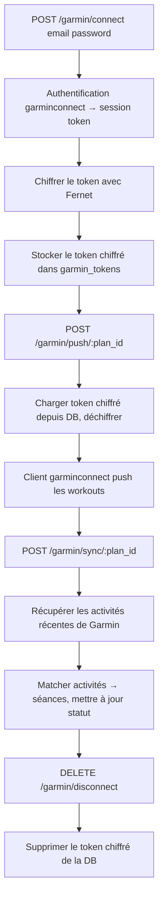
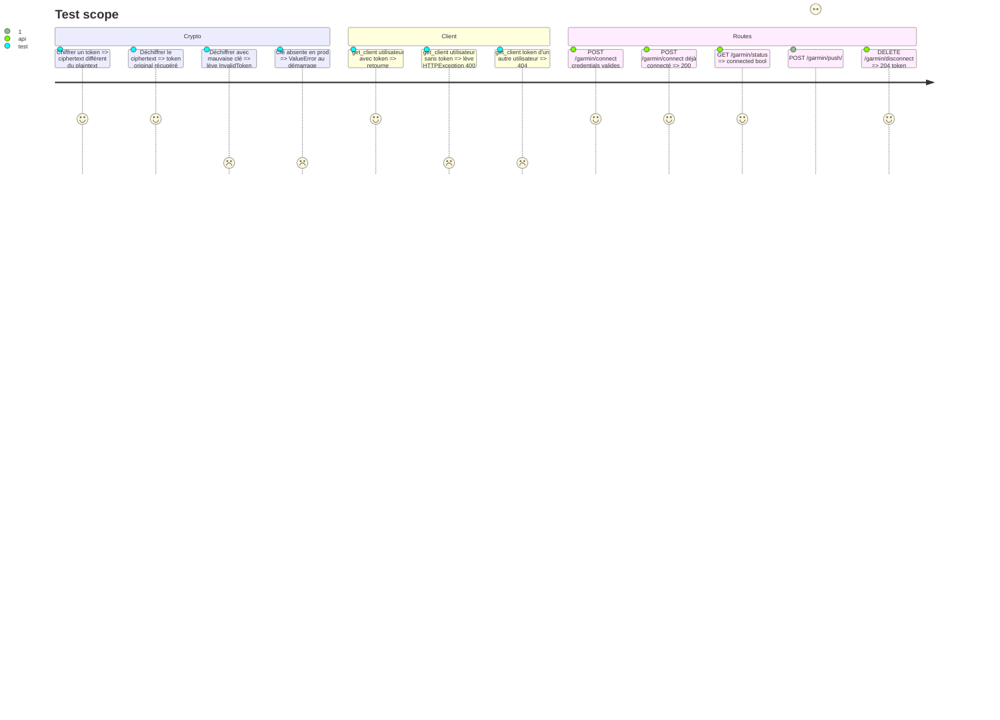

# Instruction: Per-User Garmin (Fernet Tokens + Sync)

## Architecture projection

> Tree of the final files. ✅ create · ✏️ modify · ❌ delete

```txt
backend/
  pyproject.toml                      ✏️ modify  — ajouter cryptography, garminconnect, garth
  requirements.lock                   ✏️ modify  — régénérer après ajout deps
  alembic/versions/
    006_garmin_tokens.py              ✅ create  — table garmin_tokens
  douini/
    garmin/
      __init__.py                     ✅ create
      crypto.py                       ✅ create  — wrapper Fernet pour chiffrement des tokens
      client.py                       ✅ create  — client garminconnect per-user depuis DB
      builders.py                     ✅ create  — copié depuis garmin.py actuel (_BUILDERS)
      sync.py                         ✅ create  — push_plan + sync_activities (asyncio-aware)
    db/queries/
      garmin.py                       ✅ create  — CRUD garmin_tokens
    api/routes/
      garmin.py                       ✅ create  — connect, status, push, sync, disconnect
    settings.py                       ✏️ modify  — ajouter DOUINI_ENCRYPTION_KEY
  tests/
    api/
      test_garmin.py                  ✅ create  — tests endpoints garmin + crypto
.env.example                          ✏️ modify  — ajouter DOUINI_ENCRYPTION_KEY avec instructions génération
```

## User Journey



## Test Scope



## Tasks to do

### `1)` Mettre à jour pyproject.toml avec les dépendances Garmin

> Ajouter cryptography, garminconnect, garth.

1. Ajouter dans [project].dependencies : `cryptography>=42.0`, `garminconnect==0.3.16`, `garth>=0.4`.
2. Régénérer `backend/requirements.lock` après installation.

### `2)` Mettre à jour settings.py — clé de chiffrement

> Fail-closed en prod, clé éphémère en dev.

1. Ajouter le champ `DOUINI_ENCRYPTION_KEY: str = ""`.
2. Dans `model_validator` : si `ENVIRONMENT in ("ppe", "prod")` et clé manquante, lever `ValueError("DOUINI_ENCRYPTION_KEY is required in ppe/prod")`.
3. En dev, si clé manquante : générer une clé éphémère au démarrage et logger un warning : "DOUINI_ENCRYPTION_KEY not set — using ephemeral key. Tokens will not survive restart.".
4. Ajouter dans `.env.example` : `DOUINI_ENCRYPTION_KEY=` avec la commande de génération : `python -c "from cryptography.fernet import Fernet; print(Fernet.generate_key().decode())"`.

### `3)` Créer garmin/crypto.py

> Wrapper Fernet pour chiffrement des tokens Garmin.

1. Importer `cryptography.fernet.Fernet`.
2. `get_fernet() -> Fernet` — retourne une instance Fernet depuis `settings.DOUINI_ENCRYPTION_KEY`.
3. `encrypt_token(raw: str) -> str` — retourne une chaîne ciphertext base64url.
4. `decrypt_token(ciphertext: str) -> str` — retourne la chaîne originale ; lève `InvalidToken` en cas d'échec.
5. Ne jamais logger le token brut ni la clé.

### `4)` Créer db/queries/garmin.py

> CRUD garmin_tokens, scopé par user_id.

1. `upsert_garmin_token(conn, user_id, encrypted_token) -> None` — `INSERT ... ON CONFLICT (user_id) DO UPDATE SET encrypted_token = %s, updated_at = NOW()`.
2. `get_garmin_token(conn, user_id) -> str | None` — retourne le token chiffré ou `None`.
3. `delete_garmin_token(conn, user_id) -> None`.
4. `get_garmin_status(conn, user_id) -> bool` — `True` si un token existe pour cet utilisateur.

### `5)` Créer garmin/client.py

> Client garminconnect per-user depuis DB, stateless.

1. `async def get_client(user_id: int, conn) -> garminconnect.Garmin` — charge le token chiffré depuis DB, déchiffre, restaure la session garth, retourne le client authentifié.
2. Si pas de token en DB : lever `HTTPException(400, detail="Garmin not connected")`.
3. Restauration session garth : utiliser `garth.resume(token_dict)` ou l'équivalent (reproduire le pattern de `garmin.py` de l'app actuelle).
4. Ne pas cacher le client in-process — recréer par request (stateless).

### `6)` Créer garmin/builders.py depuis l'app actuelle

> Copier les builders de workout Garmin depuis l'app actuelle.

1. Copier `_BUILDERS`, `build_garmin_workout()`, `build_session_workout()` depuis `garmin.py` de l'app actuelle.
2. Remplacer `from douini_run.engine.library import get_workout` par `from douini.domain.engine.library import get_workout`.
3. Aucun autre changement — les builders sont de la logique domain, pas de la logique app.

### `7)` Créer garmin/sync.py

> Porter push_plan et sync_activities, asyncio-aware.

1. Porter `push_plan_sessions_to_garmin()` et `sync_plan_from_garmin()` depuis l'app actuelle.
2. `async def push_plan(plan_id: int, user_id: int, db) -> dict` — charger les séances du plan, appeler le builder, pusher vers Garmin, stocker `garmin_workout_id` en DB.
3. `async def sync_activities(plan_id: int, user_id: int, db) -> dict` — récupérer les activités récentes de Garmin, matcher aux séances par date/distance, mettre à jour le statut des séances.
4. Wrapper les appels API Garmin dans `asyncio.get_event_loop().run_in_executor(None, ...)` — garminconnect est synchrone, ne pas bloquer la boucle d'événements.

### `8)` Créer api/routes/garmin.py

> 5 endpoints garmin, tous Depends(get_verified_user).

1. `POST /garmin/connect` — accepte `{email: str, password: str}`, authentifie avec Garmin, stocke le token chiffré. Ne jamais logger les credentials.
2. `GET /garmin/status` — retourne `{connected: bool}`.
3. `POST /garmin/push/{plan_id}` — déclenche `push_plan` pour le plan de l'utilisateur.
4. `POST /garmin/sync/{plan_id}` — déclenche `sync_activities`.
5. `DELETE /garmin/disconnect` — supprime le token de la DB.

### `9)` Migration Alembic 006_garmin_tokens.py

> Table garmin_tokens, 1 token par utilisateur.

1. Table `garmin_tokens` : `id SERIAL PRIMARY KEY, user_id INT REFERENCES users(id) ON DELETE CASCADE UNIQUE, encrypted_token TEXT NOT NULL, updated_at TIMESTAMPTZ DEFAULT NOW()`.

### `10)` Créer backend/tests/api/test_garmin.py

> Tests endpoints garmin + crypto avec httpx.AsyncClient + pytest-asyncio.

1. Créer `backend/tests/api/test_garmin.py` couvrant les cas listés dans le Test Scope : crypto round-trip, mauvaise clé, clé absente en prod, client avec/sans token, routes connect/status/push/sync/disconnect.
2. Mocker les appels API Garmin (garminconnect et garth) — ne pas contacter l'API réelle.
3. Utiliser une fixture de DB de test (transaction rollback) et un client `httpx.AsyncClient`.

## Known limitation: background Garmin sync

L'app actuelle utilise un `ui.timer` qui poll automatiquement Garmin. En FastAPI, le sync est uniquement on-demand via `POST /garmin/sync/{plan_id}`. Un background poller (`asyncio.create_task` dans le lifespan) est envisageable mais non planifié en v1 — acceptable pour la cible (dizaines d'utilisateurs). À traiter dans une phase dédiée si le besoin emerges.

## Test acceptance criteria

| Task | Acceptance criteria |
| ---- | ------------------- |
| 1 | cryptography, garminconnect, garth installés ; requirements.lock régénéré |
| 2 | Clé absente en prod → ValueError au démarrage ; en dev génère une clé éphémère avec warning |
| 3 | Round-trip encrypt/decrypt ; mauvaise clé lève InvalidToken |
| 4 | upsert écrase le token existant ; delete supprime la ligne |
| 5 | get_client lève 400 si pas de token ; session garth mockée retourne un client |
| 6 | Les imports de builders.py se résolvent depuis le chemin domain ; structure JSON Garmin inchangée |
| 7 | push_plan et sync_activities appellent l'API Garmin dans un executor (mocké en tests) |
| 8 | Les endpoints retournent les codes de statut corrects ; credentials absents des logs |
| 9 | Migration up/down réussit |
| 10 | Tous les cas du Test Scope passent ; appels Garmin mockés |
