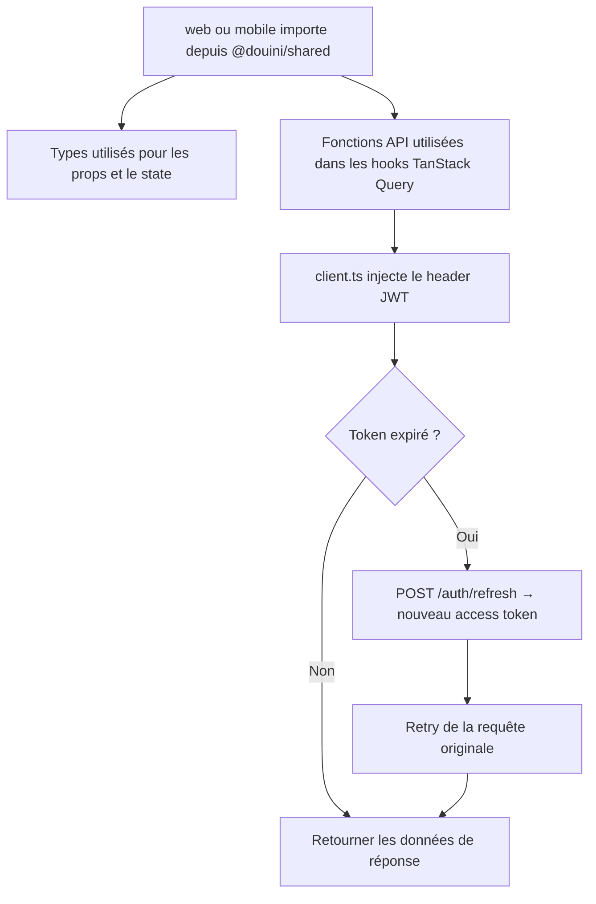
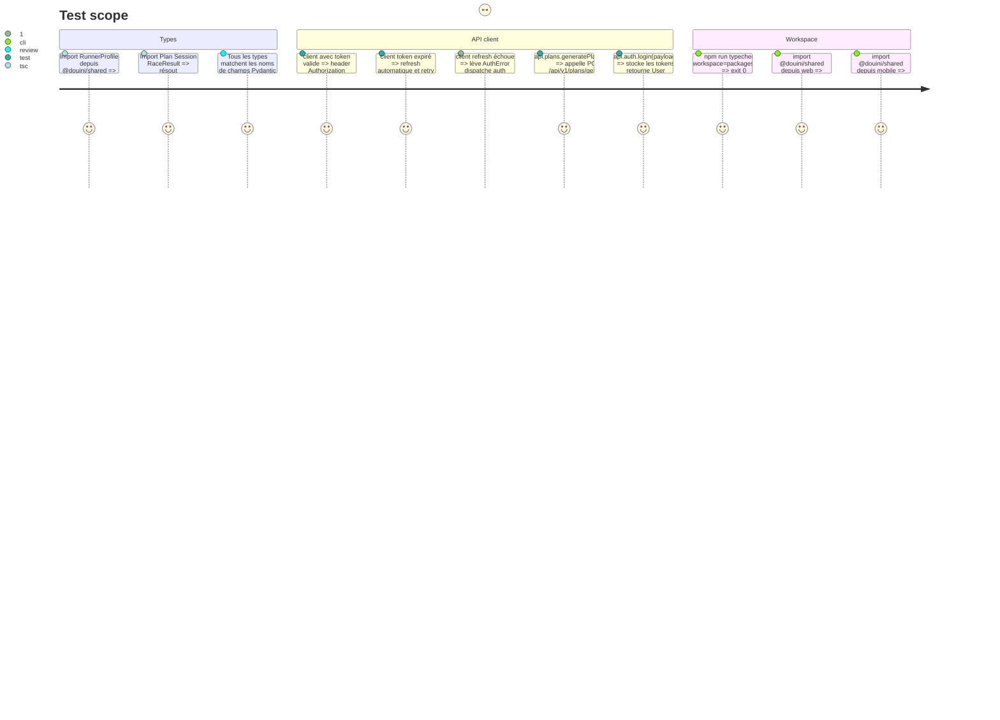

# Instruction: @douini/shared TypeScript Package

## Architecture projection

> Tree of the final files. ✅ create · ✏️ modify · ❌ delete

```txt
packages/shared/
  package.json                        ✏️ modify  — compléter scripts, exports, devDeps
  tsconfig.json                       ✏️ modify  — strict, bundler resolution, declarations
  src/
    types/
      auth.ts                         ✅ create
      plan.ts                         ✅ create
      profile.ts                      ✅ create
      session.ts                      ✅ create
      garmin.ts                       ✅ create
      race.ts                         ✅ create
      index.ts                        ✅ create  — re-export tous les types
    api/
      client.ts                       ✅ create  — base fetch, JWT auth + refresh, injectable storage
      auth.ts                         ✅ create
      plans.ts                        ✅ create
      profile.ts                      ✅ create
      sessions.ts                     ✅ create
      garmin.ts                       ✅ create
      race_results.ts                 ✅ create
      index.ts                        ✅ create  — re-export toutes les fonctions API
    index.ts                          ✏️ modify  — export depuis types/ et api/
```

## User Journey



## Test Scope



## Tasks to do

### `1)` Mettre à jour package.json et tsconfig.json

> Configurer le package et le tsconfig pour le build et le typecheck TypeScript.

1. package.json : ajouter "devDependencies": { "typescript": "^5.5" }. Ajouter "exports": { ".": { "import": "./src/index.ts", "default": "./src/index.ts" } }. Ajouter "scripts": { "typecheck": "tsc --noEmit", "build": "tsc" }.
2. tsconfig.json : { "compilerOptions": { "strict": true, "moduleResolution": "bundler", "target": "ES2022", "module": "ESNext", "declaration": true, "outDir": "dist", "rootDir": "src", "skipLibCheck": true } }.

### `2)` Créer les fichiers de types

> Définir tous les types TypeScript miroirs des schemas Pydantic du backend.

1. types/auth.ts :
   ```ts
   export interface User { id: number; email: string; email_verified: boolean; created_at: string; }
   export interface AuthTokens { access_token: string; refresh_token: string; token_type: string; }
   export interface SignupPayload { email: string; password: string; }
   export interface LoginPayload { email: string; password: string; }
   export interface ResetPasswordPayload { token: string; new_password: string; }
   ```
2. types/profile.ts — mirror exact de RunnerProfileIn/Out depuis schemas.py. Utiliser number pour les floats, string pour les enums string, string[] pour les tableaux de jours.
3. types/plan.ts — Plan, PlanDetail, PaceProfile, PlanWarning, WeekPlan, PaceZone.
4. types/session.ts — Session, SessionPatch, SessionFeedback, enum SessionStatus.
5. types/garmin.ts — GarminStatus { connected: boolean }, GarminConnectPayload { email: string; password: string }.
6. types/race.ts — RaceResult, RaceResultPayload, StatsOut.

### `3)` Créer api/client.ts

> Implémenter le client HTTP de base avec injection de JWT, refresh automatique et storage injectable.

1. API_BASE_URL depuis les variables d'env — import.meta.env.VITE_API_URL pour web, process.env.EXPO_PUBLIC_API_URL pour mobile. Résoudre via une fonction getApiBaseUrl() qui détecte l'environnement.
2. Interface injectable de storage des tokens : interface TokenStorage { getAccessToken(): string | null | Promise<string | null>; setAccessToken(t: string): void | Promise<void>; getRefreshToken(): string | null | Promise<string | null>; setRefreshToken(t: string): void | Promise<void>; clearTokens(): void | Promise<void>; }.
3. configureClient(storage: TokenStorage): void — stocke l'implémentation. Appelé une fois dans main.tsx (web) et app/_layout.tsx (mobile).
4. async function apiFetch<T>(path: string, options?: RequestInit): Promise<T> — injecte le header Authorization: Bearer <token>, gère le 401 en tentant un refresh puis en rejouant une fois. Sur échec du refresh : appeler storage.clearTokens(), dispatcher l'événement "auth:logout".
5. Exporter apiFetch et configureClient.

### `4)` Créer les modules API domaine

> Créer les fonctions API par domaine qui s'appuient sur apiFetch.

1. Pour chaque module, exporter des fonctions async nommées qui appellent apiFetch.
2. api/auth.ts : signup, login, logout, verifyEmail, resendVerification, forgotPassword, resetPassword, refreshToken.
3. api/plans.ts : generatePlan, listPlans, getPlan, deletePlan.
4. api/profile.ts : getProfile, updateProfile, getProfileCompleteness.
5. api/sessions.ts : getSession, patchSession, addFeedback, adjustSession.
6. api/garmin.ts : connectGarmin, disconnectGarmin, getGarminStatus, pushPlan, syncPlan.
7. api/race_results.ts : addRaceResult, listRaceResults, deleteRaceResult.

### `5)` Créer les fichiers index

> Centraliser les exports de types, API et configuration du package.

1. types/index.ts — export * from './auth'; export * from './plan'; export * from './profile'; export * from './session'; export * from './garmin'; export * from './race';.
2. api/index.ts — export * as auth from './auth'; export * as plans from './plans'; export * as profile from './profile'; export * as sessions from './sessions'; export * as garmin from './garmin'; export * as raceResults from './race_results';.
3. src/index.ts — export * from './types'; export * as api from './api'; export { configureClient } from './api/client';.

## Test acceptance criteria

| Task | Acceptance criteria              |
| ---- | -------------------------------- |
| 1    | npm run typecheck --workspace=packages/shared exit 0 |
| 2    | Tous les champs de type matchent les noms de champs Pydantic correspondants |
| 3    | apiFetch injecte le header correct ; la logique de refresh rejoue la requête sur 401 ; l'interface storage est injectable |
| 4    | Chaque fonction construit l'URL et la méthode HTTP correctes ; le type de retour matche le schema de réponse API |
| 5    | import { User, api } from '@douini/shared' se résout dans les workspaces web et mobile |
