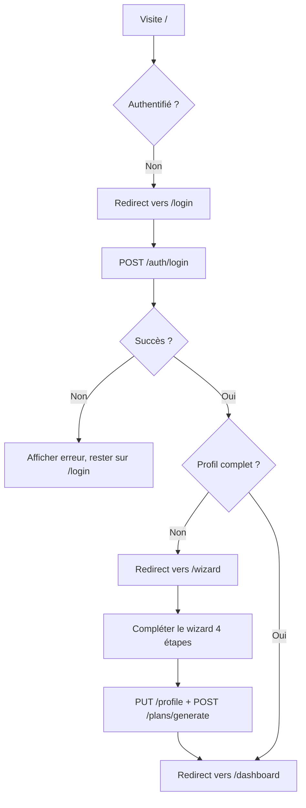
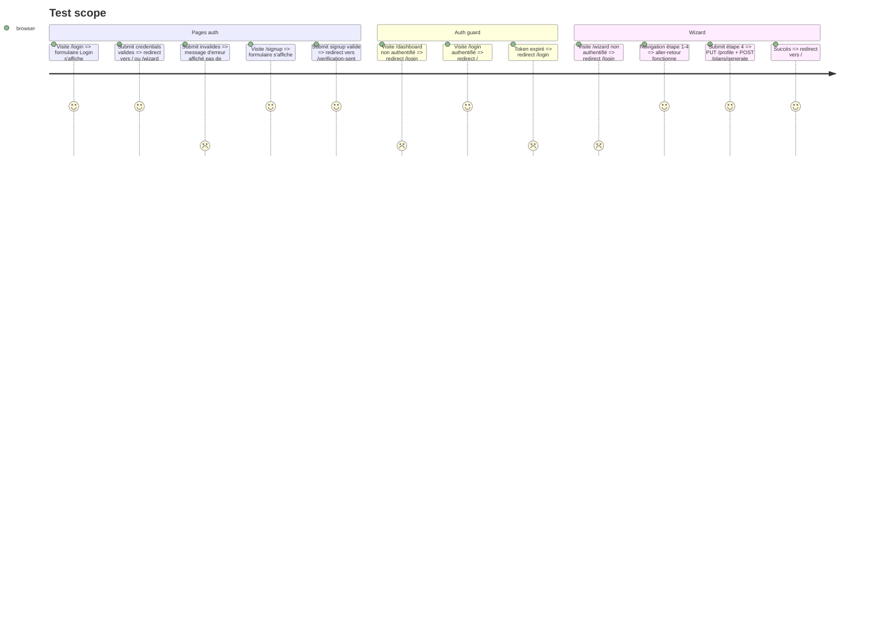

# Instruction: Web — Auth + Wizard

## Architecture projection

> Tree of the final files. ✅ create · ✏️ modify · ❌ delete

```txt
web/
  package.json                        ✏️ modify  — deps complètes: react vite tailwind tanstack react-router
  vite.config.ts                      ✅ create
  tailwind.config.ts                  ✅ create
  postcss.config.js                   ✅ create
  tsconfig.json                       ✅ create
  tsconfig.app.json                   ✅ create
  index.html                          ✅ create
  src/
    main.tsx                          ✅ create  — root React, QueryClient, RouterProvider
    router.tsx                        ✅ create  — toutes les routes, auth guard
    lib/
      queryClient.ts                  ✅ create  — config TanStack QueryClient
      tokenStore.ts                   ✅ create  — adapter localStorage
    hooks/
      useAuth.ts                      ✅ create  — login logout signup current user
    components/
      ui/
        Button.tsx                    ✅ create
        Input.tsx                     ✅ create
        Card.tsx                      ✅ create
        Alert.tsx                     ✅ create
        Spinner.tsx                   ✅ create
      layout/
        AuthLayout.tsx                ✅ create  — layout centré pour pages auth
        AppShell.tsx                  ✅ create  — sidebar nav + zone de contenu principal
    pages/
      auth/
        Login.tsx                     ✅ create
        Signup.tsx                    ✅ create
        VerifyEmail.tsx               ✅ create
        ForgotPassword.tsx            ✅ create
        ResetPassword.tsx             ✅ create
      Wizard.tsx                      ✅ create  — onboarding 4 étapes
      NotFound.tsx                    ✅ create
```

## User Journey



## Test Scope



## Tasks to do

### `1)` Mettre à jour package.json et la config build

> Configurer les dépendances, scripts et build tooling du workspace web

1. Ajouter dependencies : react@19, react-dom@19, @tanstack/react-query@^5, react-router@^7, @douini/shared.
2. Ajouter devDependencies : typescript@^5.5, @vitejs/plugin-react@^4, tailwindcss@^3.4, postcss@^8, autoprefixer@^10, @types/react@^19, @types/react-dom@^19, vite@^6.
3. Scripts : "dev": "vite", "build": "tsc -b && vite build", "typecheck": "tsc --noEmit", "preview": "vite preview".
4. vite.config.ts : plugin React, résolution de @douini/shared depuis le workspace, variable d'env VITE_API_URL, proxy /api → http://localhost:8000 en dev.
5. tailwind.config.ts : content paths couvrant src/**/*.{ts,tsx}. Ajouter les tokens couleur depuis design.py de l'app actuelle (extraire les valeurs hex : primary, surface, text, accent, success, warning, danger).

### `2)` Créer lib/tokenStore.ts

> Implémenter le stockage des tokens via localStorage et configurer le QueryClient

1. Implémenter l'interface TokenStorage de @douini/shared avec localStorage :
2. getAccessToken() : localStorage.getItem('access_token').
3. setAccessToken(t) : localStorage.setItem('access_token', t).
4. getRefreshToken(), setRefreshToken().
5. clearTokens() : retire access_token et refresh_token.
6. Créer lib/queryClient.ts : new QueryClient({ defaultOptions: { queries: { retry: 1, staleTime: 30_000 } } }).

### `3)` Créer main.tsx

> Monter React avec QueryClient, RouterProvider et brancher le client API

1. QueryClientProvider wrappant RouterProvider.
2. Appeler configureClient(tokenStore) depuis @douini/shared avant le rendu.
3. Écouter l'événement "auth:logout" → router.navigate('/login').

### `4)` Créer hooks/useAuth.ts

> Exposer l'état et les actions d'authentification aux composants

1. useAuth() retourne : user: User | null, isLoading: boolean, isAuthenticated: boolean, login(payload), logout().
2. Source de vérité : useQuery sur GET /api/v1/auth/me (ajouter cet endpoint dans routes/auth.py backend — retourne le user courant depuis le JWT).
3. login() appelle api.auth.login(), stocke les tokens via tokenStore, invalide le cache de query.
4. logout() appelle api.auth.logout(), vide les tokens, navigue vers /login.

### `5)` Créer le router avec auth guard dans router.tsx

> Définir toutes les routes avec guards d'authentification et de complétude de profil

1. Loader protégé : si pas de token → redirect('/login').
2. Loader / : si authentifié mais profil incomplet → redirect('/wizard').
3. Routes publiques : /login, /signup, /verify-email, /forgot-password, /reset-password, /verification-sent.
4. Routes protégées : / (dashboard — Phase 7), /plan (Phase 7), /wizard, /profile (Phase 7), /pantheon (Phase 7), /settings (Phase 7). Les routes Phase 7 rendent un placeholder pour l'instant.

### `6)` Créer les composants UI de base

> Construire la bibliothèque de composants réutilisables et les layouts

1. Button.tsx — variantes : primary, secondary, ghost, danger. Tailles : sm, md, lg. État loading avec Spinner et disabled.
2. Input.tsx — label, message d'erreur, texte d'aide. Composant contrôlé.
3. Card.tsx — div wrapper avec padding standard et shadow.
4. Alert.tsx — variantes : error, success, warning, info.
5. Spinner.tsx — SVG animé.
6. AuthLayout.tsx — colonne centrée, logo (ratchet.png), wrapper card.
7. AppShell.tsx — sidebar avec liens vers dashboard/plan/profile/pantheon/settings + menu utilisateur. Stub pour Phase 7.

### `7)` Créer les pages auth

> Implémenter toutes les pages d'authentification avec formulaires et gestion d'erreurs

1. Login.tsx — formulaire email + mot de passe, submit appelle login(), affiche l'erreur API, liens vers /signup et /forgot-password.
2. Signup.tsx — formulaire email + mot de passe + confirmation, submit appelle api.auth.signup(), redirect vers /verification-sent en cas de succès.
3. VerifyEmail.tsx — lit ?token= depuis l'URL, appelle api.auth.verifyEmail(token), affiche succès/erreur.
4. ForgotPassword.tsx — formulaire email, appelle api.auth.forgotPassword(), affiche toujours un message de succès (pas d'énumération).
5. ResetPassword.tsx — lit ?token= depuis l'URL, formulaire nouveau mot de passe + confirmation, appelle api.auth.resetPassword().

### `8)` Créer Wizard.tsx

> Construire l'onboarding 4 étapes avec navigation et soumission du profil

1. State local pour l'étape (1-4) et les valeurs du formulaire.
2. Étape 1 — Niveau d'expérience (debutant / intermediaire / avance), km hebdo actuels, plus longue sortie actuelle.
3. Étape 2 — Distance cible (5K / 10K / semi / marathon), temps cible.
4. Étape 3 — Séances par semaine (3-7), jours préférés, jour de sortie longue.
5. Étape 4 — Récapitulatif + confirmation. Afficher le VDOT dérivé si temps cible fourni (appel GET /profile/completeness).
6. Au submit : PUT /profile puis POST /plans/generate, redirect vers /.
7. La navigation retour ne remet pas à zéro les étapes précédentes.

## Test acceptance criteria

| Task | Acceptance criteria              |
| ---- | -------------------------------- |
| 1    | npm run dev --workspace=web démarre sur le port 5173 ; /api proxié vers le backend |
| 2    | Tokens persistent après rechargement de page ; clearTokens() retire tout |
| 3    | configureClient appelé avant le premier rendu ; événement auth:logout déclenche la navigation |
| 4    | useAuth() retourne isAuthenticated: true avec un token valide ; false après logout |
| 5    | Visite de / sans token → redirect /login ; authentifié profil incomplet → redirect /wizard |
| 6    | Tous les composants UI rendent sans erreurs TypeScript ; Button loading state affiche Spinner |
| 7    | Formulaire login gère le 401 ; Signup redirect vers la page de vérification |
| 8    | Les 4 étapes du wizard rendent ; navigation retour conserve les valeurs ; submit appelle les 2 endpoints |
