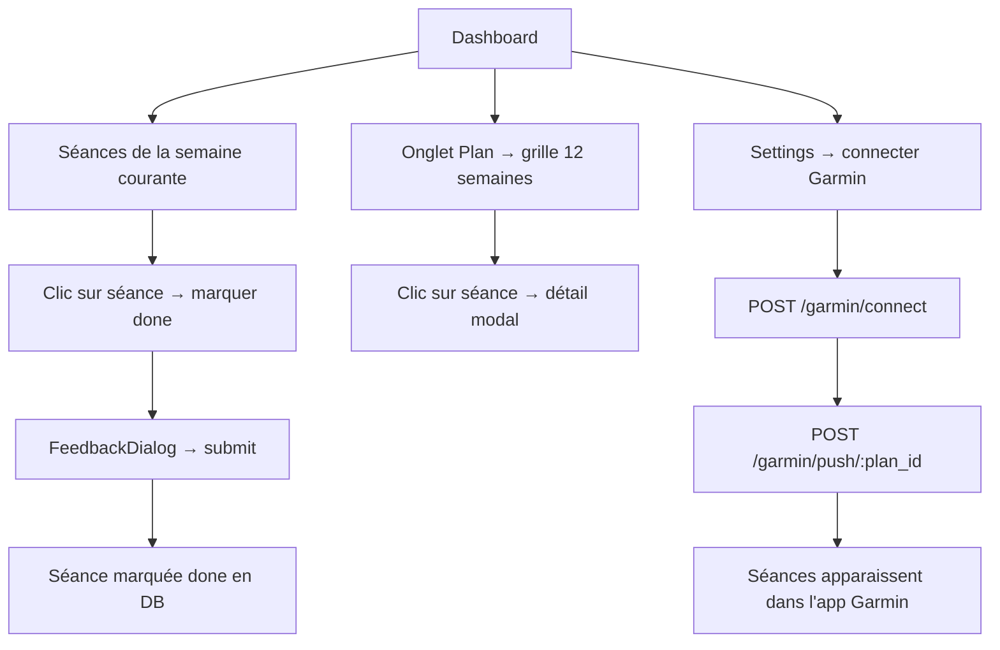
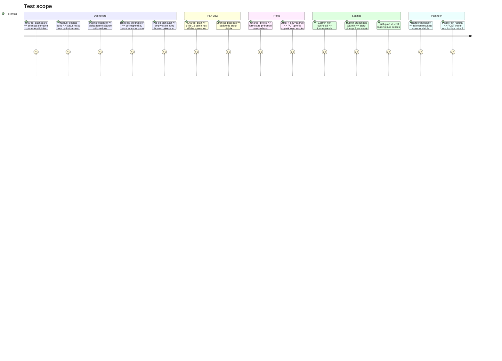

# Instruction: Web — Dashboard + Plan + Profile + Pantheon + Settings

## Architecture projection

> Tree of the final files. ✅ create · ✏️ modify · ❌ delete

```txt
web/src/
  hooks/
    usePlan.ts                        ✅ create
    useGarmin.ts                      ✅ create
    useProfile.ts                     ✅ create
  components/
    plan/
      WeekGrid.tsx                    ✅ create  — grille 12 semaines
      SessionCard.tsx                 ✅ create  — séance individuelle avec statut + actions
      PaceTable.tsx                   ✅ create  — affichage du profil d'allures
      FeedbackDialog.tsx              ✅ create  — formulaire feedback post-séance
    dashboard/
      WeekView.tsx                    ✅ create  — séances de la semaine courante
      ProgressBar.tsx                 ✅ create  — progression du plan
      GarminBanner.tsx                ✅ create  — prompt connect/sync Garmin
  pages/
    Dashboard.tsx                     ✅ create
    Plan.tsx                          ✅ create
    Profile.tsx                       ✅ create
    Pantheon.tsx                      ✅ create
    Settings.tsx                      ✅ create
  router.tsx                          ✏️ modify  — brancher les vraies pages sur les routes
```

## User Journey



## Test Scope



## Tasks to do

### `1)` Créer les hooks de data-fetching

> Implémenter les hooks TanStack Query pour profile, plan et Garmin

1. useProfile.ts : useQuery sur GET /api/v1/profile ; useMutation sur PUT /api/v1/profile. Invalider GET /profile en cas de succès.
2. usePlan.ts : useQuery sur GET /api/v1/plans (liste) ; useQuery sur GET /api/v1/plans/:id (détail) ; useMutation sur PATCH /api/v1/sessions/:id avec mise à jour optimiste du statut de session ; useMutation sur POST /api/v1/sessions/:id/feedback.
3. useGarmin.ts : useQuery sur GET /api/v1/garmin/status ; useMutation pour connect, push, sync, disconnect.

### `2)` Créer les composants plan

> Construire la grille de semaines, les cartes de séance, le tableau d'allures et le dialog de feedback

1. WeekGrid.tsx — 12 lignes (semaines), colonnes : label de phase, séances (3-7 par ligne). Chaque cellule = SessionCard. Met en évidence la semaine courante.
2. SessionCard.tsx — affiche le nom du workout, la distance, la zone, le badge de statut (pending/done/skipped/rest). Clic → ouvrir le détail ou marquer done.
3. PaceTable.tsx — tableau des zones d'allures (facile, seuil court/moyen/long, VO2) avec les valeurs min/km.
4. FeedbackDialog.tsx — modal : difficulté (1-5 étoiles), fatigue, douleur. Submit appelle la mutation addFeedback.

### `3)` Créer les composants dashboard

> Construire la vue semaine, la barre de progression et le banner Garmin

1. WeekView.tsx — affiche uniquement les séances de la semaine courante en cartes horizontales. Labels des jours (Lun/Mar/...). Clic pour marquer done.
2. ProgressBar.tsx — done / total séances. Affiche le pourcentage + "(X sur Y séances)".
3. GarminBanner.tsx — si non connecté : bouton "Connecter Garmin". Si connecté : "Dernière sync il y a X min" + bouton sync.

### `4)` Créer les pages

> Implémenter Dashboard, Plan, Profile, Pantheon et Settings avec leurs hooks et composants

1. Dashboard.tsx : récupérer le plan actif avec usePlan. Rendre GarminBanner, ProgressBar, WeekView. Si pas de plan actif : empty state "Générer votre premier plan" → /wizard.
2. Plan.tsx : récupérer le détail du plan. Rendre PaceTable + WeekGrid. Toggle entre vue d'ensemble et édition semaine par semaine.
3. Profile.tsx : récupérer le profil avec useProfile. Formulaire avec tous les champs RunnerProfile (contrôlés, préremplis). Submit appelle la mutation updateProfile. Afficher le VDOT dérivé si temps cible fourni.
4. Pantheon.tsx : récupérer les résultats de courses. Tableau des courses passées : date, distance, temps, VDOT. Formulaire pour ajouter un nouveau résultat. Graphique de progression VDOT (SVG simple ou lib légère).
5. Settings.tsx : version complète de GarminBanner avec formulaire connect (email + mot de passe), bouton disconnect, bouton push plan.

### `5)` Mettre à jour router.tsx

> Brancher les vraies pages sur toutes les routes protégées et finaliser la navigation

1. Brancher les vraies pages sur toutes les routes protégées.
2. Vérifier que tous les liens dans AppShell.tsx naviguent correctement.
3. Ajouter `<Route path="*" element={<NotFound />} />`.

## Test acceptance criteria

| Task | Acceptance criteria              |
| ---- | -------------------------------- |
| 1    | Les hooks retournent des données typées ; la mise à jour optimiste du statut de séance est visible avant la réponse serveur |
| 2-3  | Les composants rendent avec des données mockées ; SessionCard affiche le bon badge de statut |
| 4    | Dashboard affiche la semaine courante ; Plan affiche les 12 semaines ; Profile est prérempli |
| 4    | Pantheon affiche la liste des courses et la progression VDOT ; Settings affiche le statut Garmin |
| 5    | Toutes les routes accessibles ; la nav AppShell surligne la route active ; route inconnue → NotFound |
