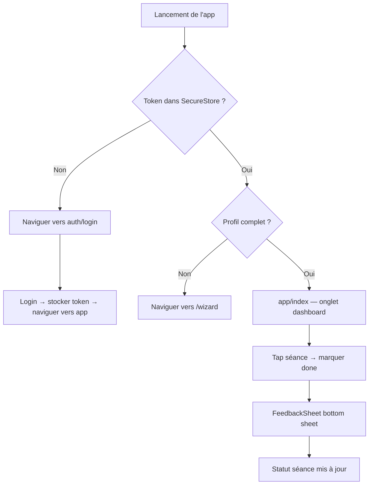
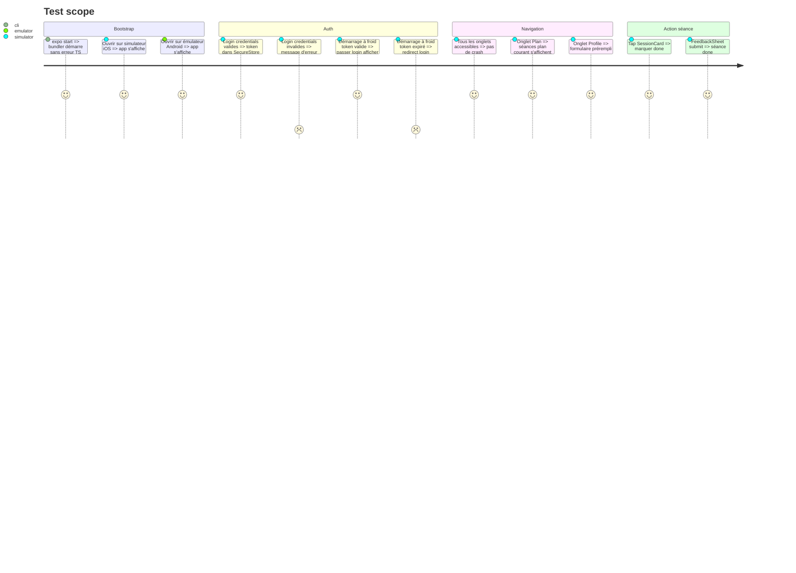

# Instruction: Mobile Expo — Auth + Dashboard + Plan + Profile

## Architecture projection

> Tree of the final files. ✅ create · ✏️ modify · ❌ delete

```txt
mobile/
  package.json                        ✏️ modify  — deps Expo complètes
  app.json                            ✏️ modify  — config Expo avec icon, splash, scheme
  babel.config.js                     ✅ create  — preset expo
  tsconfig.json                       ✏️ modify  — extends expo tsconfig.base
  assets/
    icon.png                          ✅ create  — icône placeholder (adapter ratchet.png)
    splash.png                        ✅ create  — splash placeholder
  app/
    _layout.tsx                       ✅ create  — root: QueryClient, auth check, splash
    (auth)/
      _layout.tsx                     ✅ create  — Stack navigator, pas de tab bar
      login.tsx                       ✅ create
      signup.tsx                      ✅ create
      verify-email.tsx                ✅ create
    (app)/
      _layout.tsx                     ✅ create  — Tabs: dashboard plan profile
      index.tsx                       ✅ create  — onglet dashboard
      plan/
        index.tsx                     ✅ create  — liste des plans
        [id].tsx                      ✅ create  — détail plan + grille semaines
      profile.tsx                     ✅ create  — formulaire profil
    wizard/
      index.tsx                       ✅ create  — onboarding 4 étapes
  lib/
    tokenStore.ts                     ✅ create  — adapter expo-secure-store
    queryClient.ts                    ✅ create  — config TanStack Query
  components/
    SessionCard.tsx                   ✅ create  — vue native RN
    WeekList.tsx                      ✅ create  — FlatList des séances
    PaceTable.tsx                     ✅ create  — tableau d'allures natif
```

## User Journey



## Test Scope



## Tasks to do

### `1)` Compléter package.json et la config Expo

> Configurer les dépendances et la toolchain Expo du workspace mobile

1. Ajouter les dépendances Expo : expo@^53, expo-router@^4, expo-secure-store, expo-status-bar, expo-splash-screen, @expo/vector-icons, react-native@0.76, @tanstack/react-query@^5, @douini/shared.
2. app.json : scheme: "douinirun", android.package: "fr.douinirun.app", ios.bundleIdentifier: "fr.douinirun.app", références icône et splash.
3. babel.config.js : module.exports = { presets: ['babel-preset-expo'] }.
4. tsconfig.json : { "extends": "expo/tsconfig.base", "compilerOptions": { "strict": true } }.

### `2)` Créer lib/tokenStore.ts — adapter SecureStore

> Implémenter le stockage des tokens via expo-secure-store et configurer le QueryClient

1. Implémenter la même interface TokenStorage que le web mais avec expo-secure-store :
2. getAccessToken() : SecureStore.getItemAsync('access_token').
3. setAccessToken(t) : SecureStore.setItemAsync('access_token', t).
4. getRefreshToken(), setRefreshToken().
5. clearTokens() : supprimer access_token et refresh_token.
6. Créer lib/queryClient.ts : new QueryClient({ defaultOptions: { queries: { retry: 1, staleTime: 30_000 } } }).

### `3)` Créer le layout root app/_layout.tsx

> Monter les providers, vérifier l'auth au démarrage et gérer le splash screen

1. Wrapper avec QueryClientProvider et GestureHandlerRootView.
2. Appeler configureClient(tokenStore) depuis @douini/shared.
3. Au montage : vérifier le token dans SecureStore. Si absent → router.replace('/(auth)/login'). Si présent → vérifier la complétude du profil → redirect wizard si incomplet.
4. Utiliser expo-splash-screen pour masquer le splash après la vérification.

### `4)` Créer les screens auth

> Implémenter login, signup et verify-email avec le Stack navigator Expo Router

1. (auth)/login.tsx — TextInput email + mot de passe, bouton submit, naviguer vers (app) en cas de succès, afficher l'erreur si 401.
2. (auth)/signup.tsx — email + mot de passe + confirmation, naviguer vers un screen "vérifiez votre email" en cas de succès.
3. (auth)/verify-email.tsx — afficher les instructions, pas de deep link dans cette phase.
4. Le Stack auth utilise le navigator Stack d'Expo Router — pas de tab bar visible.

### `5)` Créer le layout des onglets (app)/_layout.tsx

> Configurer la tab bar avec Dashboard, Plan et Profile

1. Utiliser Tabs d'Expo Router avec 3 onglets : Dashboard (icône home), Plan (icône calendar), Profile (icône person).
2. Icônes depuis @expo/vector-icons/Ionicons.
3. Header avec le nom de l'app et bouton logout dans l'onglet Profile.

### `6)` Créer (app)/index.tsx — Dashboard

> Afficher les séances de la semaine courante avec actions de marquage et feedback

1. Récupérer le plan actif avec TanStack Query (api.plans.listPlans()).
2. Afficher les séances de la semaine courante dans un WeekList (FlatList).
3. Chaque ligne : label du jour, nom du workout, distance, puce de statut.
4. Tap → bottom sheet avec bouton "Marquer done" + FeedbackSheet (modal bas de page).
5. Pas de plan actif → empty state "Créer votre plan" → /wizard.

### `7)` Créer (app)/plan/index.tsx et [id].tsx

> Implémenter la liste des plans et la vue détail avec grille de semaines

1. index.tsx — liste des plans (généralement 1). Tap → [id].
2. [id].tsx — afficher toutes les semaines en SectionList (sections = semaines). Chaque item = ligne de séance. Afficher le tableau du profil d'allures au-dessus de la liste.

### `8)` Créer (app)/profile.tsx

> Construire le formulaire de profil avec tous les champs et affichage du VDOT

1. Formulaire avec tous les champs du profil (TextInput, Picker pour les enums, MultiSelect pour les jours).
2. Submit appelle la mutation updateProfile.
3. Affiche le VDOT courant.

### `9)` Créer wizard/index.tsx

> Implémenter l'onboarding 4 étapes avec soumission du profil et génération du plan

1. Flux 4 étapes avec state local + compteur d'étapes useState.
2. Mêmes données collectées que le wizard web.
3. Au submit : updateProfile + generatePlan, naviguer vers (app).

### `10)` Créer les composants partagés

> Construire SessionCard, WeekList et PaceTable en primitives React Native

1. SessionCard.tsx — View/Text/TouchableOpacity React Native. Même logique que le web SessionCard mais primitives natives.
2. WeekList.tsx — FlatList de SessionCard.
3. PaceTable.tsx — grille View + Text (pas de `<table>`).

## Test acceptance criteria

| Task | Acceptance criteria              |
| ---- | -------------------------------- |
| 1    | expo start s'exécute sans erreur ; tsc --noEmit exit 0 |
| 2    | Les tokens survivent au redémarrage de l'app via SecureStore ; clearTokens retire tout |
| 3    | Démarrage à froid avec token valide affiche le dashboard ; sans token affiche le login |
| 4-5  | Les screens auth naviguent correctement ; la tab bar visible après login |
| 6-8  | Dashboard/plan/profile rendent les données de l'API (avec serveur mocké en test) |
| 9    | Le wizard se complète et navigue vers le dashboard |
| 10   | Les composants rendent sur simulateur iOS et émulateur Android |
