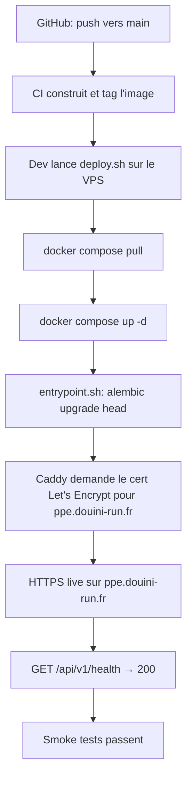
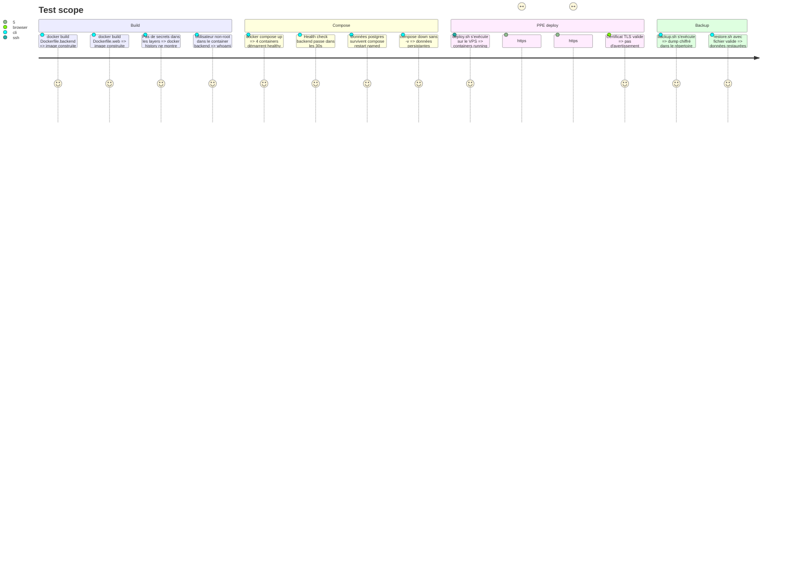

# Instruction: Docker + Caddy + PPE Deployment

## Architecture projection

> Tree of the final files. ✅ create · ✏️ modify · ❌ delete

```txt
infra/
  Dockerfile.backend                  ✅ create  — multi-stage: build + runtime slim, pip install --require-hashes
  Dockerfile.web                      ✅ create  — node build + nginx:alpine static
  compose.yml                         ✅ create  — app + web + postgres + caddy
  compose.dev.yml                     ✏️ modify  — ajouter service backend optionnel
  Caddyfile                           ✅ create  — HTTPS, proxy API, serve web
  .dockerignore                       ✅ create
  scripts/
    deploy.sh                         ✅ create  — pull image, compose up, health check
    backup.sh                         ✅ create  — pg_dump chiffré vers répertoire offsite
    restore.sh                        ✅ create  — restauration depuis fichier de backup
    entrypoint.sh                     ✅ create  — alembic upgrade head puis uvicorn
.env.example                          ✏️ modify  — ajouter vars POSTGRES_* et CADDY_HOST
docs/
  deployment.md                       ✅ create  — setup PPE pas-à-pas et promotion PROD
```

## User Journey



## Test Scope



## Tasks to do

### `1)` Créer infra/Dockerfile.backend

> Multi-stage build utilisant requirements.lock avec --require-hashes.

1. Stage builder : `FROM python:3.11-slim AS builder`. Copier `backend/requirements.lock`, installer les deps dans `/install` avec `pip install --no-cache-dir --require-hashes -r requirements.lock`.
2. Stage runtime : `FROM python:3.11-slim`. Copier `/install` depuis builder. Copier `backend/douini/` vers `/app/douini`. Copier `infra/scripts/entrypoint.sh` vers `/app/`. `WORKDIR /app`. Créer un user non-root `nonroot` et passer en `USER nonroot`. `CMD ["/app/entrypoint.sh"]`.
3. Pas de secrets dans l'image. ENV uniquement pour config non-secrète (`PYTHONUNBUFFERED=1`, `PYTHONDONTWRITEBYTECODE=1`).

### `2)` Créer infra/scripts/entrypoint.sh

> Alembic upgrade puis uvicorn.

1. Script bash : `#!/usr/bin/env bash`, `set -euo pipefail`, `alembic upgrade head`, `exec uvicorn douini.api.main:app --host 0.0.0.0 --port 8000`.
2. Rendre le script exécutable (`chmod +x`).

### `3)` Créer infra/Dockerfile.web

> Node build + nginx:alpine static avec fallback SPA.

1. Stage builder : `FROM node:22-alpine AS builder`. Copier les fichiers workspace, `npm ci`, `npm run build --workspace=web`. Output dans `web/dist/`.
2. Stage runtime : `FROM nginx:1.27-alpine`. Copier `web/dist/` vers `/usr/share/nginx/html`. Copier une config nginx custom avec fallback SPA (toutes les routes → `index.html`).

### `4)` Créer infra/compose.yml

> 4 services : postgres, backend, web, caddy.

1. `postgres` : `postgres:16-alpine`, volume nommé `pgdata`, health check `pg_isready -U $POSTGRES_USER`. Vars d'env depuis `.env`. Port 5432 interne uniquement.
2. `backend` : buildé depuis `Dockerfile.backend`. Dépend de `postgres` healthy. Vars d'env depuis `.env` (pas de secrets inline dans le compose file). Port 8000 interne uniquement.
3. `web` : buildé depuis `Dockerfile.web`. Port 80 interne uniquement.
4. `caddy` : `caddy:2-alpine`, ports `80:80` et `443:443`. Monte le `Caddyfile` et le volume `caddy_data`. Dépend de `backend` et `web`.

### `5)` Créer infra/Caddyfile

> HTTPS auto, proxy API, serve web.

1. `{$CADDY_HOST}` avec `handle /api/* { reverse_proxy backend:8000 }` et `handle { reverse_proxy web:80 }`.
2. `CADDY_HOST=ppe.douini-run.fr` en PPE, `douini-run.fr` en PROD.

### `6)` Créer infra/.dockerignore

> Exclure tout ce qui n'est pas nécessaire au build.

1. Exclure : `.git/`, `node_modules/`, `**/__pycache__/`, `*.pyc`, `.env`, `*.db`, `.venv/`, `mobile/`, `.github/`, `docs/`, `aidd_docs/`.

### `7)` Créer infra/scripts/deploy.sh

> Pull, compose up, health check.

1. Script bash : `#!/usr/bin/env bash`, `set -euo pipefail`, `IMAGE_TAG="${1:?Usage: deploy.sh <image-tag>}"`, `cd /opt/douini`, `export BACKEND_IMAGE=$IMAGE_TAG`, `docker compose pull`, `docker compose up -d --remove-orphans`, `sleep 5`, `curl --fail --silent http://localhost:8000/api/v1/health`, `echo "Deploy OK — $IMAGE_TAG"`.

### `8)` Créer infra/scripts/backup.sh et restore.sh

> Backup pg_dump chiffré, restore avec confirmation.

1. `backup.sh` : `docker compose exec postgres pg_dump -U $POSTGRES_USER $POSTGRES_DB | gzip > /opt/douini/backups/backup_$(date +%Y%m%d_%H%M%S).sql.gz`. Optionnel : `gpg --symmetric` pour chiffrement.
2. `restore.sh` : accepte le chemin du fichier de backup, prompt de confirmation avant opération destructive, `gunzip | psql`.

### `9)` Créer docs/deployment.md

> Setup PPE pas-à-pas et promotion PROD.

1. Prérequis (Docker, accès SSH, domaine pointant vers le VPS).
2. Premier déploiement : générer les secrets, copier le `.env`, `docker compose up -d`, vérifier les certificats Caddy.
3. Mises à jour : `deploy.sh <image-tag>`.
4. Schedule des backups (cron).
5. Promotion PROD : vider les volumes, nouveaux secrets, mise à jour DNS, smoke tests.
6. Procédure de rollback : `docker compose up -d --scale backend=0`, puis redéployer l'image précédente.

### `10)` Mettre à jour .env.example

> Ajouter vars POSTGRES et CADDY.

1. Ajouter : `POSTGRES_DB=douini`, `POSTGRES_USER=douini`, `POSTGRES_PASSWORD=changeme`, `CADDY_HOST=ppe.douini-run.fr`.

## Test acceptance criteria

| Task | Acceptance criteria |
| ---- | ------------------- |
| 1-2 | docker build réussit ; `docker history` ne montre pas de secrets ; user non-root confirmé ; `--require-hashes` utilisé |
| 3 | Build web produit `dist/` ; nginx sert le SPA (route inconnue retourne `index.html`) |
| 4 | Les 4 containers démarrent ; le health check postgres passe avant le démarrage backend |
| 5 | `https://ppe.douini-run.fr` sert le web ; `/api/v1/health` retourne 200 |
| 6 | `.dockerignore` exclut `.env` et `node_modules` du contexte |
| 7 | `deploy.sh` s'exécute sans erreur ; health check passe après déploiement |
| 8 | `backup.sh` crée un fichier ; `restore.sh` restaure les données en DB de test isolée |
| 9 | `deployment.md` couvre toutes les étapes dont rollback |
